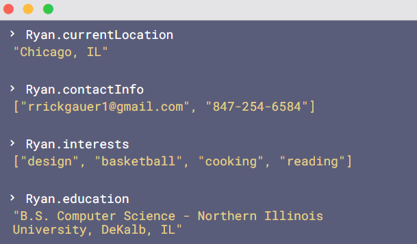

### Hi there 👋

This is the place where I opensource stuff and break things :rofl:

- 🔭 I’m currently working on something cool :wink:
- 🌱 I’m currently learning C++ Multithreading
- 💬 Ask me about anything related to C++, COBOL, Python, PHP
- 📫 How to reach me: [www.RyanRickgauer.com](https://www.ryanrickgauer.com/resume/index.html)
- ⚡ Fun fact: I :heart: :dog:s

 

---

